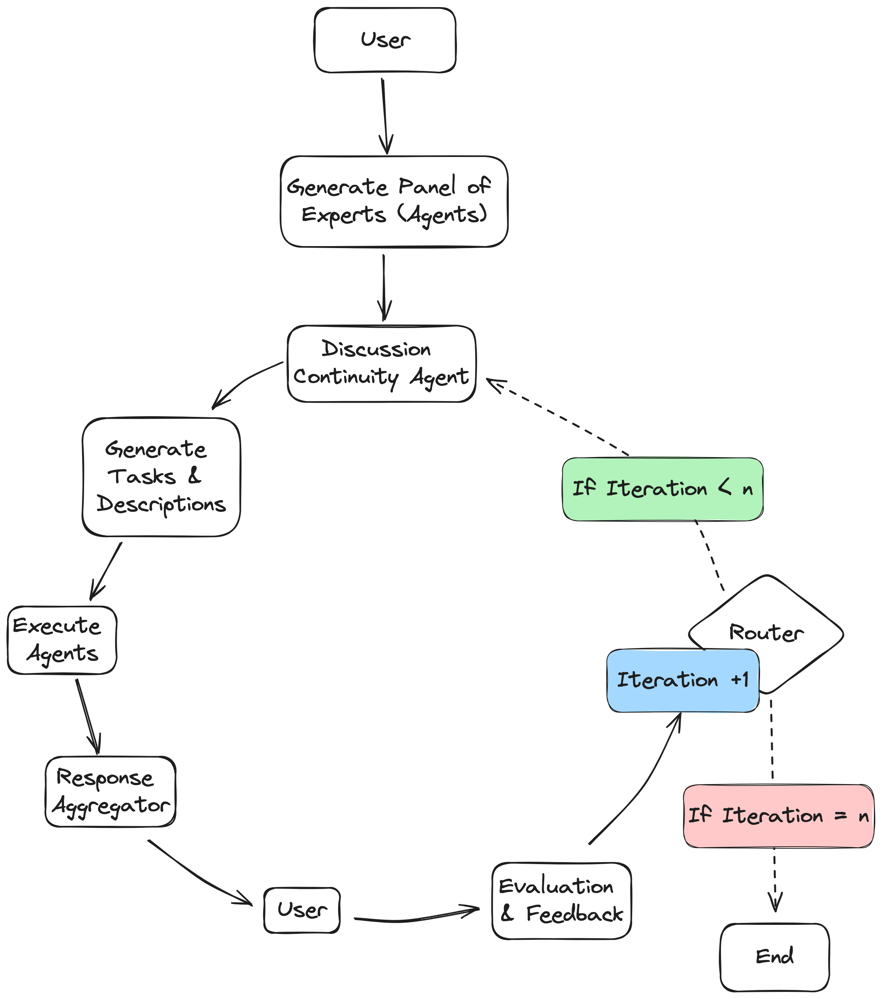

# Autonomous Panel of Experts Framework
## Introduction
In this project, we leverage the multi-agent framework 'LangGraph' to autonomously create a panel of experts which serve as different stakeholders to a complex problem. These agents work together to formulate a proposed solution that aligns with the collective interests of all stakeholders and user preferences. Using reflection, human-in-the-loop feedback, and chain of thought reasoning, this framework iteratively improves generated responses.

A case study to demonstrate this framework is demand response in the electric power systems field. Demand response is a strategy that involves adjusting electricity usage in response to supply conditions or price signals to maintain grid stability and manage energy consumption.

## Framework Workstream

1. **Ideation**: a) Analyzes the user's problem statement, b) Create necessary AI agents to solve the problem

3. **Delegation**: a) Generate and assign a description and list of tasks for each agent

4. **Execution & Synthesis**: a) Use a LLM to run each agent given their description, name, and assigned tasks, b) Aggregate responses from all agents and consolidates "best" approaches and presents to user for rating

5. **Evaluation**: a) Assess solution quality and its alignment with user prompt, b) User gives a rating from 1-5 based on accuracy, relevance, and completeness, c) Identify steps to follow for improvement in next iteration

## Features
- **Multi-Agent Collaboration**: Agents share information and work together to solve complex problems.
- **Agent Supervision**: A supervisor agent directs queries to independent agents and consolidates their responses.
- **Hierarchical Agent Teams**: Agents operate in a hierarchical structure, with each node functioning as a supervisor.
- **Stateful Interactions**: LangGraph supports stateful elements, enabling more sophisticated and context-aware applications.
- **Chain of Thought Reasoning**: The framework leverages chain of thought reasoning to enhance the quality and depth of responses.
- **Agentic Design**: The agentic design allows for the creation of customized agents and workflows, providing a high degree of controllability and flexibility. This design mimics human iterative processes, leading to better outcomes by enabling agents to specialize in specific tasks and collaborate effectively.
- **Human-in-the-Loop Feedback**: The framework prompts the user to give a rating on accuracy, relevance, and completeness. An AI agent then takes this feedback to provide next steps for the next iteration.
- **Reflection and Iterative Improvement**: The system uses reflection techniques to analyze its own performance and iteratively improve its responses based on both human feedback and self-evaluation.

## Case Study: Demand Response in Electric Power Systems
Demand response involves adjusting electricity usage in response to supply conditions or price signals to maintain grid stability and manage energy consumption. This framework can automate the analysis and decision-making process in this context.
